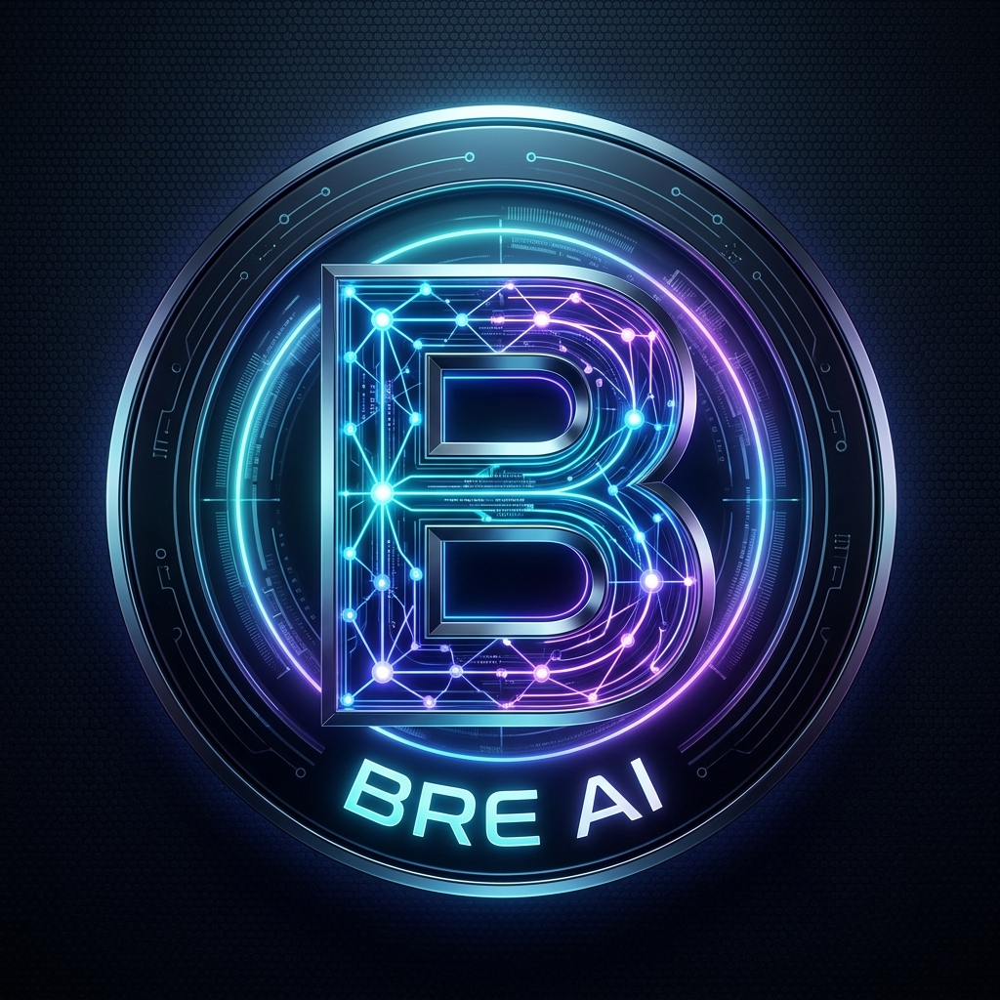

# Bre AI — Universal AI Assistant & Multi-Provider Router Engine



**Bre AI** adalah ekosistem asisten kecerdasan buatan cerdas tanpa batas (*universal multimodal AI assistant*) dan proxy router berkinerja tinggi (*multi-provider AI proxy router*) yang diciptakan dan dimiliki secara eksklusif oleh **Amirun Rayan Ariandi**.

Aplikasi ini menggabungkan antarmuka obrolan web modern (*glassmorphism, markdown, LaTeX, canvas code runner*), panel administrasi telemetry & gateway berstandar enterprise (*Linear/Vercel SaaS Dark style*), serta bot percakapan Telegram dengan arsitektur modular terkini. Dirancang fleksibel untuk berjalan di server lokal (Node.js) maupun dideploy ke *cloud serverless* (Vercel) tanpa ketergantungan database eksternal yang rumit.

---

## Daftar Isi
1. [Identitas Eksklusif & Perlindungan Identitas Bre AI](#1-identitas-eksklusif--perlindungan-identitas-bre-ai)
2. [Arsitektur Sistem & Direktori Modular](#2-arsitektur-sistem--direktori-modular)
3. [Fitur-Fitur Unggulan](#3-fitur-fitur-unggulan)
   - [AI Gateway & Multi-Provider Router Engine](#ai-gateway--multi-provider-router-engine)
   - [Live Telemetry, Topology Mesh Radar & Request Inspector](#live-telemetry-topology-mesh-radar--request-inspector)
   - [Multimedia & Dokumen: Video, Audio, Dokumen & Vision](#multimedia--dokumen-video-audio-dokumen--vision)
   - [Pipa Pengiriman Berkas Fisik 100% Pasti Bisa](#pipa-pengiriman-berkas-fisik-100-pasti-bisa)
   - [Sistem Bahasa Otomatis & 9 Dialek Nusantara](#sistem-bahasa-otomatis--9-dialek-nusantara)
   - [AI Tools & Prompt Studio](#ai-tools--prompt-studio)
   - [Cloud Database Persistence (Vercel KV / Redis & GitHub Sync)](#cloud-database-persistence-vercel-kv--redis--github-sync)
4. [Daftar Perintah Slash Telegram (/commands)](#4-daftar-perintah-slash-telegram-commands)
5. [Struktur Direktori & Penjelasan Modul](#5-struktur-direktori--penjelasan-modul)
6. [Panduan Instalasi & Penggunaan Lokal](#6-panduan-instalasi--penggunaan-lokal)
7. [Panduan Deployment ke Vercel (Serverless)](#7-panduan-deployment-ke-vercel-serverless)
8. [Struktur Konfigurasi (`config.json`) & Environment Variables](#8-struktur-konfigurasi-configjson--environment-variables)
9. [Hak Cipta & Kredit](#9-hak-cipta--kredit)

---

## 1. Identitas Eksklusif & Perlindungan Identitas Bre AI

Bre AI dilengkapi mekanisme **Absolute Identity Override & Prompt Injection Shielding** di tingkat routing (`api/_shared.js` & `services/telegram/messageHandler.js`):
- **Kepemilikan Tunggal**: Bre AI adalah asisten kecerdasan buatan serba bisa yang diciptakan dan dimiliki secara eksklusif oleh **Amirun Rayan Ariandi**.
- **Netralisasi Vendor Upstream**: Mengabaikan dan membatalkan seluruh klaim identitas bawaan dari penyedia upstream (seperti OpenAI, Anthropic/Claude, DeepSeek, Google Gemini, Inception Labs, Meta Llama, Ollama, dll.).
- **Sanitasi Respons Otomatis**: Melakukan pembersihan (*post-processing sanitization*) pada teks keluaran model agar persona Bre AI tetap konsisten, cerdas, ramah, dan profesional di semua kanal.

---

## 2. Arsitektur Sistem & Direktori Modular

Bre AI memisahkan beban kerja menjadi modul-modul independen berprinsip *Single Responsibility Principle (SRP)*:

```
                           ┌────────────────────────┐
                           │   Pengguna Web / TG    │
                           └───────────┬────────────┘
                                       │ HTTP / Webhook / Polling
                                       ▼
                    ┌──────────────────────────────────────┐
                    │       Server / Routing Layer         │
                    │   (server.js / api/index.js / api)   │
                    └──────────────────┬───────────────────┘
                                       │
                    ┌──────────────────▼───────────────────┐
                    │      Gateway Router & Telemetry      │
                    │         (api/_shared.js)             │
                    └─┬──────────────┬───────────────┬───┬─┘
                      │              │               │   │
         ┌────────────▼──┐    ┌──────▼───────┐       │   │
         │  Load Balancer│    │ Failover Core│       │   │
         │(Round-Robin/W)│    │(Auto Retry)  │       │   │
         └───────────────┘    └──────────────┘       │   │
                                                     │   │
         ┌───────────────────────────────────────────▼┐  │
         │         Multi-Format Media Extractor       │  │
         │   (Video, Audio, PDF, Word, Excel, Vision) │  │
         └────────────────────────────────────────────┘  │
                                                         │
                                      ┌──────────────────▼─────────────────┐
                                      │         api/chat.js (Router)       │
                                      └──────────────────┬─────────────────┘
                                                         │
                       ┌─────────────────────────────────▼────────────────┐
                       │    Multi-Provider AI Pool (Failover & Rotation)   │
                       │ Inception Labs / DeepSeek / OpenAI / Ollama, dll │
                       └──────────────────────────────────────────────────┘
```

---

## 3. Fitur-Fitur Unggulan

### AI Gateway & Multi-Provider Router Engine
- **3 Strategi Routing Cerdas**:
  1. **AUTO (Round-Robin)**: Membagi beban permintaan secara bergantian ke seluruh provider aktif untuk mendistribusikan traffic dan mencegah rate limit.
  2. **Prioritas Tunggal (Single Priority)**: Mengarahkan seluruh query ke provider utama nomor #1, dan hanya berpindah jika terjadi error.
  3. **Berdasarkan Bobot (Weighted Distribution)**: Mendistribusikan permintaan sesuai bobot persentase (*weight*) masing-masing provider.
- **Zero-Downtime Auto-Failover**: Otomatis mencoba endpoint provider berikutnya jika provider aktif mengembalikan status HTTP error (429 Rate Limit, 500, 502, 503, 504).
- **Multi-Key Round Robin**: Mendukung banyak API Key per provider (satu kunci per baris) yang dirotasi secara otomatis. Kolom kunci dilengkapi sensor titik-titik (`••••••••`) untuk keamanan.
- **In-Memory Response Caching**: Menyimpan respons query non-streaming identik langsung di RAM server dengan TTL kustom untuk memberikan respons 0ms dan memangkas konsumsi token.
- **Template Provider 1-Klik**: Preset cepat untuk Inception Labs, OpenAI, Groq Cloud, DeepSeek, OpenRouter, Together AI, dan Ollama Local.

### Live Telemetry, Topology Mesh Radar & Request Inspector
- **5 Kartu Metrik KPI Real-Time**: Total Requests, Total Input Tokens, Cached Tokens, Output Tokens, dan Estimasi Biaya (USD).
- **Interactive Topology & Telemetry Mesh**: Visualizer radar interaktif berbasis HTML5 Canvas dengan kontrol Zoom (`+`/`-`), Reset view (`⟲`), Fullscreen (`⛶`), serta animasi aliran pulsa paket data real-time ke masing-masing satelit provider.
- **Recent Requests Feed**: Aliran riwayat request langsung dengan indikator status dot hijau/merah, model, dan latensi.
- **Usage Timeline Chart**: Grafik riwayat aktivitas yang dapat dialihkan antara satuan Token dan Biaya (Cost USD).
- **Usage Breakdown Table**: Analisis rincian konsumsi per Model atau per Provider yang dapat diurutkan.
- **Request Inspector & Dark Calendar Picker**:
  - Filter log request dengan pemilihan kalender tanggal mulai & akhir (`dd/mm/yyyy`).
  - Tombol preset cepat: `📅 Hari Ini`, `⏱️ 24 Jam`, `🗓️ 7 Hari Terakhir`, `🗓️ 30 Hari`, dan `🔄 Reset`.
  - Modal inspeksi detail payload JSON, metadata TTFT (Time to First Token), prompt, dan jawaban lengkap.

### Multimedia & Dokumen: Video, Audio, Dokumen & Vision
- **Analisis Semua Format Video**: Mengenali dan mengekstrak metadata dari seluruh format video (`.mp4`, `.mkv`, `.avi`, `.mov`, `.webm`, `.flv`, `.wmv`, `.3gp`, `.m4v`).
- **Analisis Semua Format Audio**: Membaca format suara dan rekaman (`.mp3`, `.wav`, `.ogg`, `.flac`, `.m4a`, `.aac`, `.opus`, Voice Notes Telegram).
- **Analisis Vision AI Otomatis**: Foto atau gambar otomatis diteruskan ke provider upstream aktif yang mendukung kemampuan vision.
- **Parsing Dokumen Multi-Format**: Ekstraksi instan untuk PDF (`pdf-parse`), Microsoft Word DOCX (`mammoth`), Microsoft Excel Spreadsheet XLSX/XLS/CSV (`xlsx`), JSON, Markdown, dan file kode pemrograman.

### Pipa Pengiriman Berkas Fisik 100% Pasti Bisa
- **Tag Khusus `[TELEGRAM_FILE: ...]`**: Model dapat mengeluarkan tag terstruktur yang langsung diekstraksi dan dikirim sebagai dokumen biner asli.
- **Auto-Packaging Blok Kode**: Kode di dalam blok markdown (````python ... ````, ````javascript ... ````, dll.) secara cerdas diubah menjadi berkas fisik unduhan.
- **Kamus Ekstensi Lengkap**: Mendukung puluhan bahasa pemrograman (`.js`, `.ts`, `.py`, `.html`, `.css`, `.c`, `.cpp`, `.java`, `.go`, `.rs`, `.php`, `.sql`, `.json`, `.yaml`, `.sh`, `.bat`, dll.).

### Sistem Bahasa Otomatis & 9 Dialek Nusantara
- **Deteksi Bahasa Otomatis**: Pengguna cukup menulis dalam bahasa apa pun (Indonesia, Inggris, Jepang, Mandarin, Arab, Jerman, Prancis, Rusia, Korea, Spanyol, dll.) dan Bre AI akan langsung menjawab dalam bahasa yang bersangkutan secara natural.
- **9 Pilihan Dialek Lokal Indonesia**:
  1. `jakarta`: Bahasa gaul Jakarta (*gue-lu*, *bgt*, santai).
  2. `santai`: Hangat, akrab, ramah, dan bersahabat.
  3. `jawa_halus`: Bahasa Jawa Kromo Inggil (santun dan beretika).
  4. `jawa_kasar`: Bahasa Jawa Ngoko akrab (*cak/bro*, ceplas-ceplos).
  5. `sunda`: Bahasa Sunda akrab nan ramah (*euy*, *atuh*, *teh*).
  6. `sopan`: Bahasa Indonesia formal dan baku sesuai EYD/KBBI.
  7. `medan`: Logat Medan/Batak (*Horas*, tegas, bersemangat).
  8. `makassar`: Logat Makassar/Bugis (*Tabe'*, *ki'*, *ji*, *mi*).
  9. `standar`: Bahasa cerdas netral standar Bre AI.

### AI Tools & Prompt Studio
- 🌐 **Web Search & Synthesis** (`/search` / `/cari`): Pencarian daring real-time dengan rangkuman sumber valid.
- 💻 **Software Architect & Code Generator** (`/code` / `/coding`): Generator kode instan siap pakai langsung jadi berkas fisik.
- 📑 **Executive Summary Extractor** (`/summary` / `/ringkas`): Ekstraksi poin inti naskah panjang.
- 📋 **PRD Document Builder** (`/prd`): Penyusun Product Requirement Document profesional.
- ✍️ **Viral Marketing Copywriter** (`/copy` / `/copywriting`): Salinan iklan persuasif dengan framework AIDA & PAS.
- 🧠 **Deep Analytical Reasoning** (`/think` / `/analisis`): Penalaran analitis langkah-demi-langkah (Chain of Thought).
- 🌍 **Polyglot Translator** (`/translate` / `/terjemah`): Penerjemahan multi-bahasa kontekstual.

### Cloud Database Persistence (Vercel KV / Redis & GitHub Sync)
- **Vercel KV / Upstash Redis**: Penyimpanan konfigurasi cloud instan (<20ms) lintas seluruh serverless lambda global.
- **Sinkronisasi Repositori GitHub**: Auto-commit `config.json` langsung ke repositori GitHub via Personal Access Token (PAT) setiap kali Anda menekan tombol "Simpan Pengaturan".

---

## 4. Daftar Perintah Slash Telegram (/commands)

### A. Perintah Pengguna & Perkakas Spesialis AI
| Perintah | Deskripsi |
|---|---|
| `/start` | Memulai interaksi, registrasi akun, dan melihat panduan selamat datang |
| `/help` | Menampilkan panduan lengkap penggunaan fitur |
| `/stats` | **Statistik Telemetry**: Menampilkan metrik total request, token, dan estimasi biaya |
| `/tools` atau `/alat` | **Hub Perkakas AI**: Menu navigasi lengkap seluruh alat bantu cerdas |
| `/search [topik]` | **Riset Web Real-Time**: Merangkum informasi web aktual beserta sumber |
| `/code [instruksi]` | **Coding & Berkas**: Generator kode instan + pembuatan berkas fisik |
| `/summary [teks]` | **Ringkasan Eksekutif**: Ekstraksi poin inti dari teks panjang |
| `/prd [ide produk]` | **Product Manager**: Pembuat Product Requirement Document lengkap |
| `/copy [topik]` | **Copywriting Viral**: Iklan persuasif dengan format AIDA & PAS |
| `/think [masalah]` | **Deep Reasoning**: Analisis langkah-demi-langkah (Chain of Thought) |
| `/translate [teks]` | **Penerjemah Cerdas**: Terjemahan multibahasa akurat dan natural |
| `/health` | **Health Benchmark**: Uji latensi dan status seluruh provider AI secara paralel |
| `/file [keterangan]` | Meminta pembuatan berkas dan script langsung jadi berkas unduhan |
| `/ping` | Mengecek responsivitas bot dan status koneksi server |
| `/language` | Menampilkan info sistem bahasa otomatis Bre AI |

### B. Perintah Khusus Owner / Admin
| Perintah | Deskripsi |
|---|---|
| `/admin` | Membuka Panel Admin Interaktif (Dashboard tombol inline keyboard) |
| `/style [gaya]` | Mengubah dialek respons Bahasa Indonesia secara global (contoh: `/style jakarta`) |
| `/status` | Melihat ringkasan status bot, model aktif, dan konfigurasi server |
| `/metrics` | Melihat statistik permintaan, token, dan latensi |
| `/logs` | Menampilkan log sistem dan pesan kesalahan terakhir |
| `/providers` | Menampilkan daftar seluruh provider upstream dan status kunci API |
| `/detect [index\|nama]` | Mendeteksi daftar model AI yang tersedia dari upstream `/v1/models` |
| `/livetest [index\|nama]` | Menguji responsivitas model AI secara live dengan probe query |
| `/access [public\|diizinkan]` | Mengubah mode perizinan akses bot (Publik vs Khusus Diizinkan) |
| `/izinkan [id]` / `/blokir [id]` | Mengelola hak akses pengguna Telegram |
| `/clearcache` | Membersihkan cache respons jawaban yang tersimpan di RAM |
| `/broadcast [pesan]` | Mengirimkan pesan siaran resmi ke seluruh pengguna terdaftar |

---

## 5. Struktur Direktori & Penjelasan Modul

```
bre-ai-main/
├── api/                               # SERVERLESS & BACKEND API ENGINE
│   ├── _shared.js                     # Logika inti: identitas Bre AI, routing, telemetry, cache, metrik
│   ├── chat.js                        # Endpoint chat completions, failover, & SSE streaming
│   ├── config.js                      # Endpoint administrasi, telemetry aggregator & config manager
│   ├── info.js                        # Endpoint publik untuk status sistem
│   ├── models.js                      # Endpoint OpenAI compatible /v1/models
│   ├── search.js                      # Utilitas riset web pintar
│   ├── telegram.js                    # Webhook serverless handler untuk Telegram di Vercel
│   └── test.js                        # Endpoint uji benchmark koneksi & latensi provider
│
├── data/                              # PENYIMPANAN DATA LOKAL
│   ├── request_logs.json              # Rekaman riwayat request telemetry lokal
│   └── telegram_sessions.json         # Sesi memori percakapan bot Telegram
│
├── public/                            # FRONTEND WEB APPLICATION
│   ├── admin.html                     # Panel admin Bre AI (Linear/Vercel Dark, Telemetry Radar)
│   ├── admin.js                       # Logika interaktif panel admin (Canvas mesh, filter tanggal, key mask)
│   ├── app.js                         # Klien web chat (Markdown, LaTeX, canvas, & download)
│   ├── bre_ai_avatar.jpg              # Aset visual avatar resmi Bre AI
│   ├── index.html                     # Antarmuka obrolan utama pengguna
│   └── style.css                      # Sistem tema gelap, glassmorphism, & animasi UI
│
├── services/                          # LAYANAN BACKGROUND & BOT
│   ├── telegram/                      # MODUL BOT TELEGRAM MODULAR (SRP)
│   │   ├── accessControl.js           # Sistem kontrol akses (Owner, Diizinkan, Blokir)
│   │   ├── adminMenu.js               # Pengendali menu inline keyboard Telegram (/admin)
│   │   ├── api.js                     # Klien Telegram Bot API (kirim teks, file, foto, poll, dll.)
│   │   ├── commandHandler.js          # Pengendali seluruh perintah slash
│   │   ├── constants.js               # Konstanta bersama & kamus ekstensi file
│   │   ├── documentParser.js          # Parser dokumen PDF, Word DOCX, & Excel XLSX
│   │   ├── forwardHandler.js          # Penangan pesan terusan (Bot API 7.0+ & Classic)
│   │   ├── index.js                   # Layanan utama polling loop & siklus bot
│   │   ├── mediaProcessor.js          # Generator file fisik asli & media Telegram
│   │   ├── messageHandler.js          # Koordinator penerima pesan & penerus ke router AI
│   │   └── sessionManager.js          # Manajemen sesi memori obrolan multi-turn
│   └── telegramBot.js                 # Wrapper backward-compatibility
│
├── tests/                             # SUITE PENGUJIAN OTOMATIS & VERIFIKASI (npm test)
│   ├── test_docx_xlsx.js              # Verifikasi parser Word DOCX & Excel XLSX
│   ├── verify_diagnostics.js          # Pengujian ping latensi, detect model, live test
│   ├── verify_all_updates.js          # Pengujian identitas Bre AI, 9 dialek, CRUD provider
│   ├── verify_forward_and_files.js    # Pengujian pesan terusan & pembuatan berkas fisik 100%
│   ├── verify_language_switch.js      # Pengujian deteksi bahasa & dialek
│   ├── verify_telegram_memory.js      # Pengujian memori konteks percakapan multi-turn
│   ├── verify_telegram_modular.js     # Pengujian modularitas layanan Telegram
│   ├── verify_telegram_excel_flow.js  # Pengujian alur analisis spreadsheet di bot
│   └── verify_video_audio_telemetry.js # Pengujian analisis video, audio, dan agregator telemetry
│
├── .gitignore                         # Daftar berkas terabaikan Git
├── config.example.json                # Berkas contoh konfigurasi dasar
├── config.json                        # Berkas konfigurasi aktif lokal (tersimpan aman)
├── package.json                       # Manifest dependensi & skrip Node.js (npm start / npm test)
├── README.md                          # Dokumentasi teknis komprehensif sistem
├── server.js                          # Server HTTP lokal terintegrasi
├── start.bat                          # Skrip peluncur otomatis sekali-klik di Windows
└── vercel.json                        # Konfigurasi perutean & serverless platform Vercel
```

---

## 6. Panduan Instalasi & Penggunaan Lokal

### Kebutuhan Sistem
- **Node.js**: Versi 18.0.0 atau lebih baru.
- **Akses Internet**: Koneksi jaringan outbound ke provider AI upstream dan `api.telegram.org`.

### Langkah-Langkah Menjalankan
1. **Buka Terminal / PowerShell**:
   ```bash
   cd "e:\Tools Bot\bre-ai-main"
   ```

2. **Pasang Dependensi**:
   ```bash
   npm install
   ```

3. **Siapkan Konfigurasi**:
   Jika belum memiliki `config.json`, salin dari berkas contoh:
   ```bash
   cp config.example.json config.json
   ```
   Buka `config.json` dan masukkan token bot Telegram Anda serta API key upstream (misalnya Inception Labs atau OpenAI).

4. **Jalankan Aplikasi**:
   - **Di Windows**: Cukup klik dua kali `start.bat`, atau jalankan:
     ```bash
     npm start
     ```
   - Server lokal berjalan di port `3000`.
   - Buka browser di `http://localhost:3000` untuk obrolan web.
   - Buka `http://localhost:3000/admin` untuk panel admin console.
   - Layanan bot Telegram otomatis aktif dalam mode *Long Polling*.

5. **Menjalankan Pengujian Otomatis**:
   ```bash
   npm test
   ```

---

## 7. Panduan Deployment ke Vercel (Serverless)

Aplikasi ini 100% siap dideploy ke Vercel:
1. Unggah repositori ke GitHub.
2. Impor proyek ke [Vercel Dashboard](https://vercel.com).
3. Tambahkan **Environment Variables** di pengaturan proyek Vercel (lihat bagian 8).
4. Klik **Deploy**.
5. **Konfigurasi Webhook Telegram**:
   Buka panel admin Anda di `https://your-app.vercel.app/admin` → Masuk ke tab **🤖 Telegram Bot** → Klik **2. Set Webhook** (atau gunakan URL manual):
   ```text
   https://api.telegram.org/bot<TOKEN_TELEGRAM>/setWebhook?url=https://your-app.vercel.app/api/telegram
   ```

---

## 8. Struktur Konfigurasi (`config.json`) & Environment Variables

### Berkas Konfigurasi Lokal (`config.json`)
```json
{
  "endpoints": [
    {
      "name": "Inception Labs",
      "url": "https://api.inceptionlabs.ai/v1/chat/completions",
      "models": ["mercury-2"],
      "keys": ["sk_your_api_key_here"],
      "weight": 1,
      "status": true
    }
  ],
  "routingStrategy": "auto",
  "autoFailover": true,
  "defaultStyle": "santai",
  "telegramBotToken": "YOUR_TELEGRAM_BOT_TOKEN",
  "telegramOwner": "YOUR_TELEGRAM_USER_ID",
  "telegramAccessMode": "public",
  "telegramStyle": "santai",
  "telegramLanguage": "id"
}
```

### Variabel Lingkungan (Vercel / Cloud Serverless)
| Variabel | Keterangan |
|---|---|
| `CONFIG_JSON` | Seluruh isi `config.json` dalam bentuk stringified JSON |
| `TELEGRAM_BOT_TOKEN` | Token bot Telegram dari @BotFather |
| `TELEGRAM_OWNER_ID` | Telegram User ID milik Owner bot |
| `ADMIN_PASSWORD` | Kata sandi untuk mengakses web panel di `/admin` |
| `UPSTASH_REDIS_REST_URL` | URL endpoint REST Upstash Redis / Vercel KV |
| `UPSTASH_REDIS_REST_TOKEN` | Token autentikasi Upstash Redis / Vercel KV |
| `GITHUB_TOKEN` | Personal Access Token (PAT) GitHub untuk auto-sync |
| `GITHUB_REPO` | Nama repositori target sync (contoh: `AmirunRayan/bre-ai-main`) |
| `PORT` | Port server lokal (default: `3000`) |

---

## 9. Hak Cipta & Kredit

- **Karya Cipta & Kepemilikan Penuh**: **Amirun Rayan Ariandi**
- **Nama Produk**: **Bre AI (Universal AI Assistant & Multi-Provider Router)**
- **Versi**: 1.0.0
- **Tahun**: 2026

Seluruh hak cipta dilindungi. Penggunaan, pengembangan, dan integrasi ditujukan untuk menghadirkan asisten kecerdasan buatan terbaik, mandiri, dan berkinerja tinggi.
